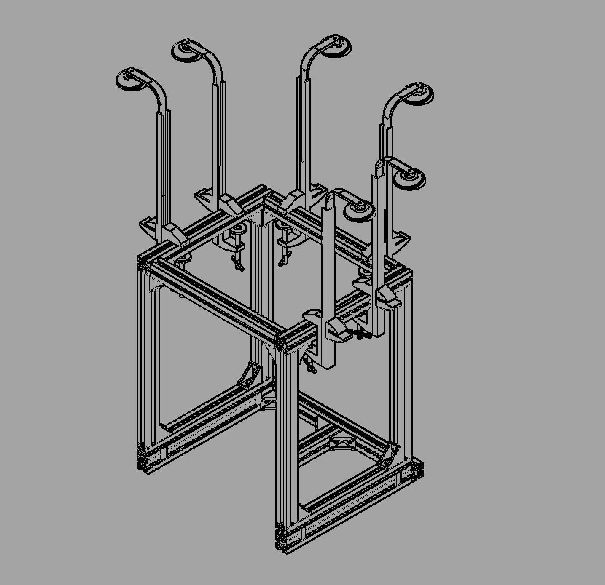
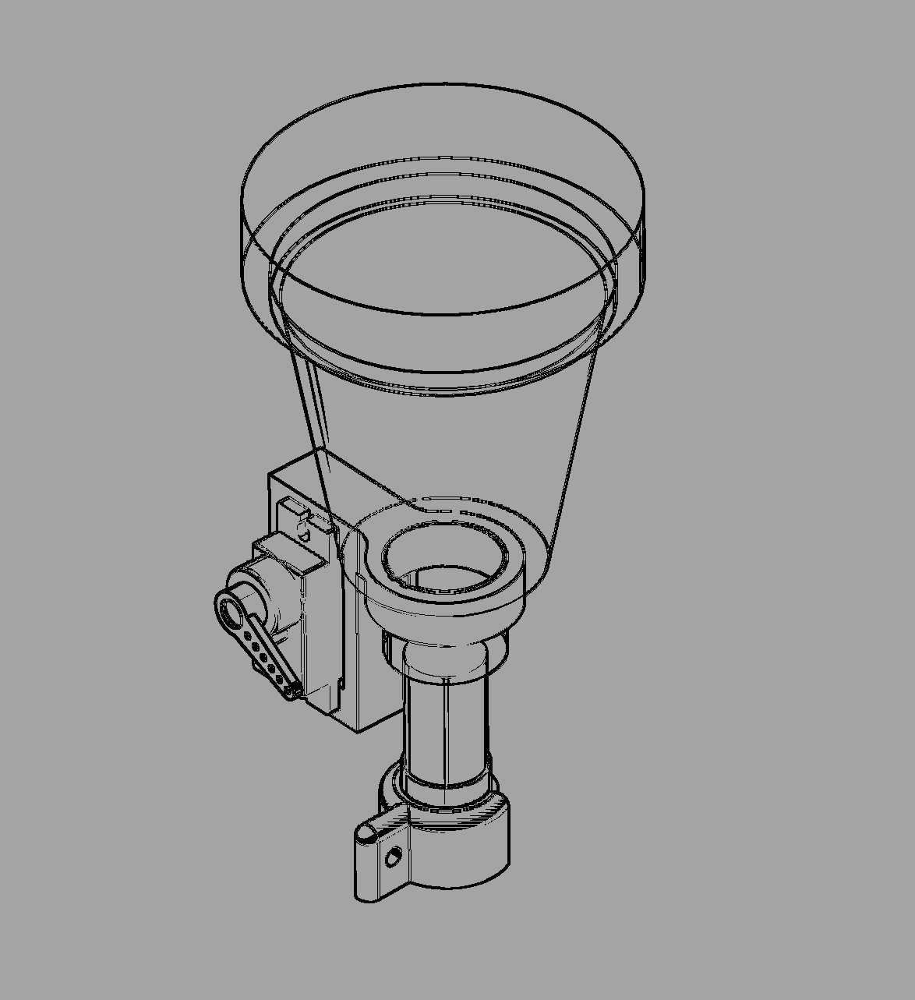
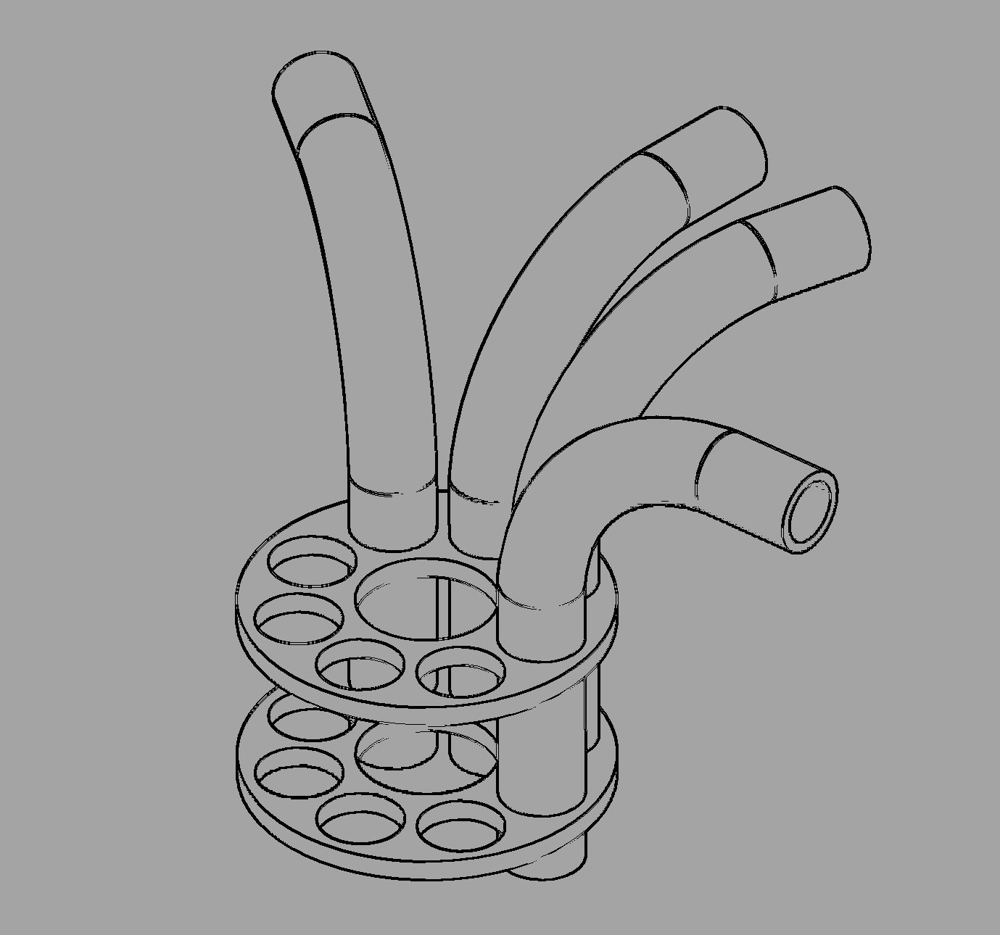
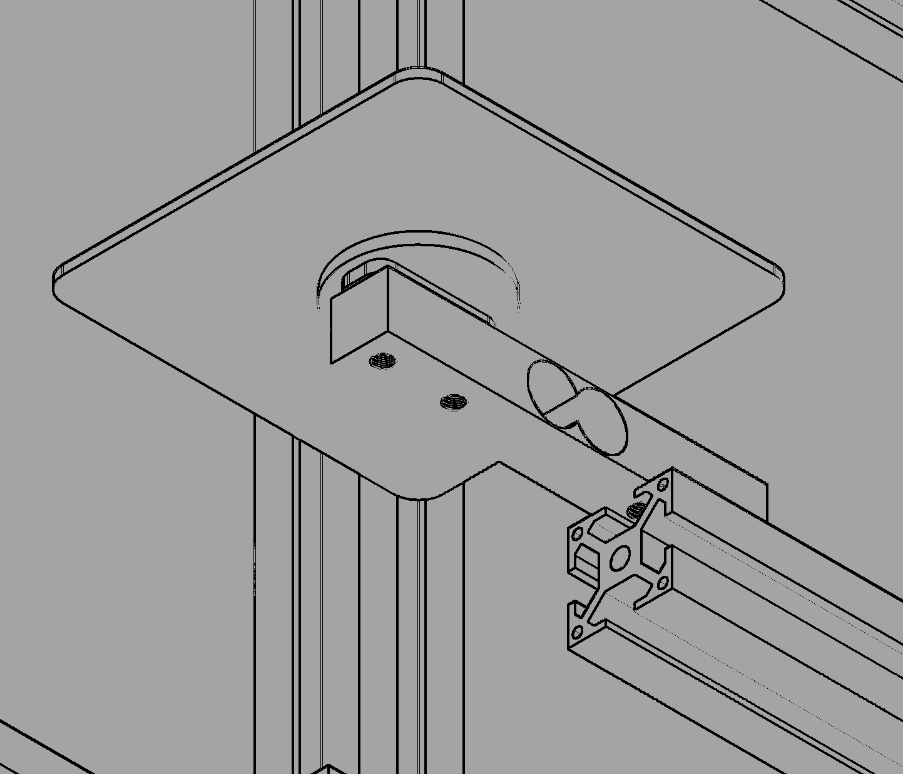
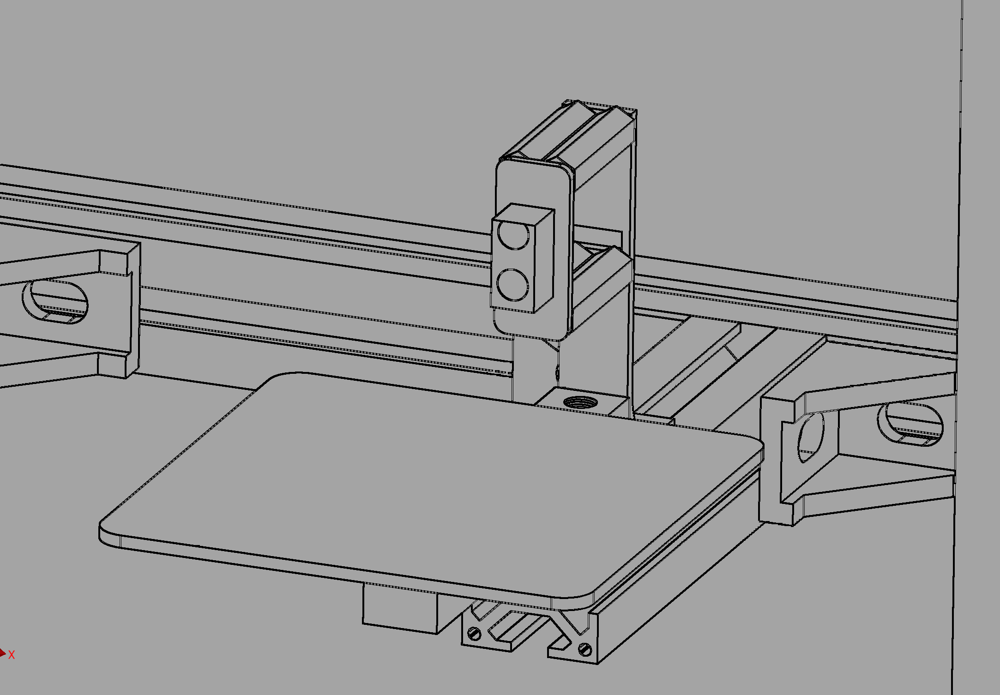
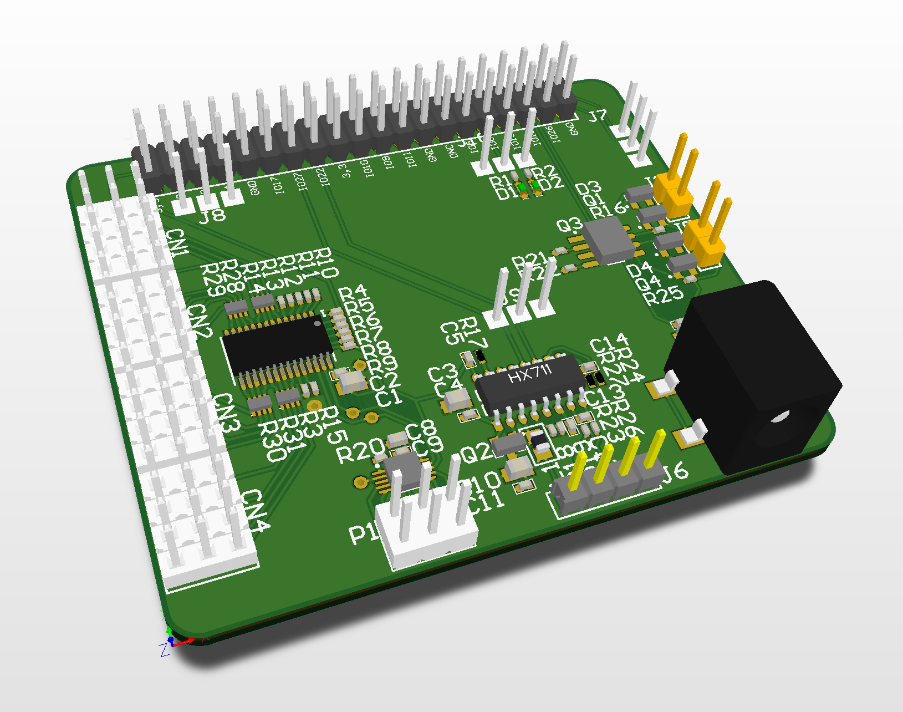
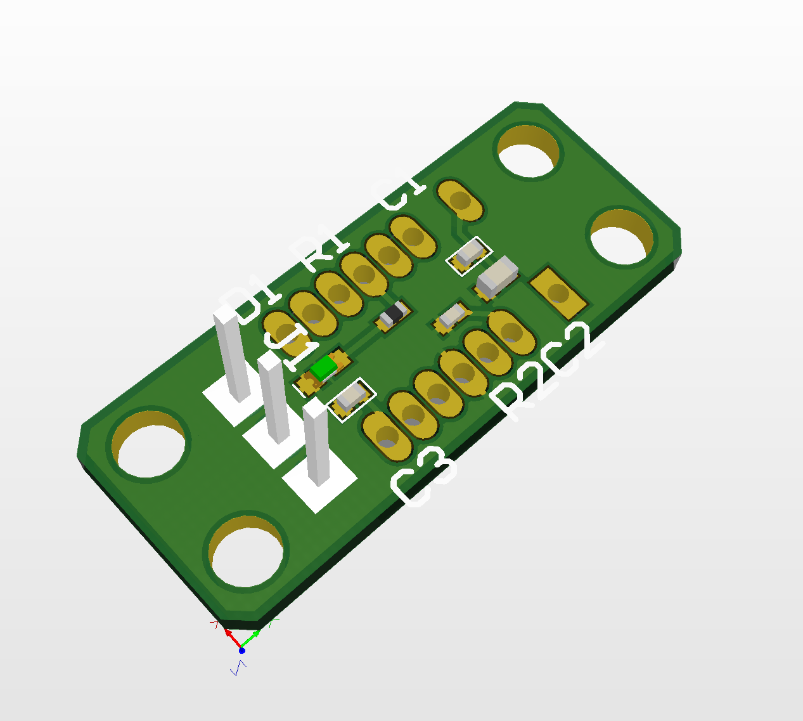

# Hardware Design

## Mechanical Build
The system was modelled in Autodesk Inventor Professional and comprised of aluminium extrusion and fixtures, COTS optics 
with rail mounts, and custom designed 3D printed PLA components. 
### Manufactured frame

The dispensing systems operates through a 9g servo mounted on each optic, with a metal strut connecting it to the base of the 
plunger. As the servo rotates, the plunger mechanism is pulled upwards, closing the fill-line to the bottle, opening the 
dispenser line, and allowing air return via a sprung element within the optic.

### Optic dispensing assembly

Food grade PVC tubes run from each optic and are held centrally above the receptacle by two aligning components.

### Dispenser alignment

The user's drinking vessel is placed upon a carbon fiber plate, mounted to a load cell with a printed element. This is 
then rigidly mounted to the frame for feedback within the dispensing system.

### Loadcell baseplate

Behind this is a digital proximity sensor, providing detection of a cup on the plate, held in position by a sliding 
printed mounting on the extrusion.
###Proximity sensor mounting

### Design files

Inventor parts and assembly files are provided, with additional STL models for printed components. Technical drawings 
for key parts are also included, and can also be derived from the inventor documents in mm scale. 

## Electronic Design
The system electronics were designed utilising Altium's CircuitMaker open-hardware designer. This package provides added 
functionality in ways of a community generated parts library integrated with the Octopart component database, aiding in 
speed of design and distributor oriented part selection and BOM generation. The main shield went through two revisions. 
An initial low quality test PCB created in house at the Univeristy of Glasgow featured the base servo control 
functionality, and aided in iterating the mechanical design.  The final board was designed to a higher specification and 
manufactured using JLCPCB's prototype PCB service.

### Final shield rendering

The populated board provided the following core features:
* x8 Servo channels
* x1 Load cell amplifier input
* x1 Digital proximity sensor input
* x2 Debug GPIO pins with LEDs

For future development, pads were also provided for:
* x8 Additional servo channels
* x4 General purpose ADC inputs
* x1 Spare load cell amplifier channel
* x2 Opto-isolated solenoid drivers with 12V rail

### Proximity sensor board

An additional board was built to mount the digital proximity sensor and it's required circuitry, and can be built out of 
un-finished FR4 easily. Alternatively, several expansion boards are available for the same or similar ICs,  and the 
design utilised uses the same recommended schematic and layout design.

For full design files, see the publicly accessible CircuitMaker project: https://circuitmaker.com/Projects/Details/Peter-Fleming-2/UoG-mai-automated-bar

