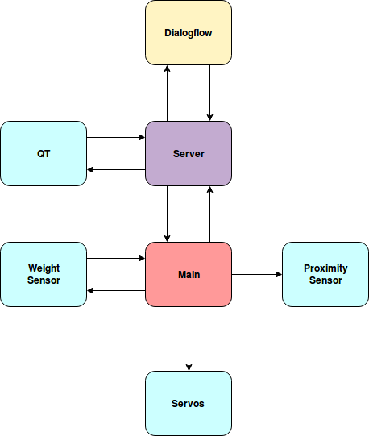

# Automated-Bar
This project aims to produce a low-cost automated drinks vending system for use in high-end consumer and commercial applications.

## Features
Scalable to any assortment of spirits/mixer

Google API integration for voice ordering

Extensive crawled database of recipes

## Hardware
Raspberry Pi 3 Model B

SAMD21G microcontroller

Backend web server

Servo and solenoid actuated optic dispensing

### Completed as a project towards Real Time Embedded Programming 5 at the University of Glasgow
## Hardware 
A complete parts list and build instructions can be found on 
## Download and Build Instructions

